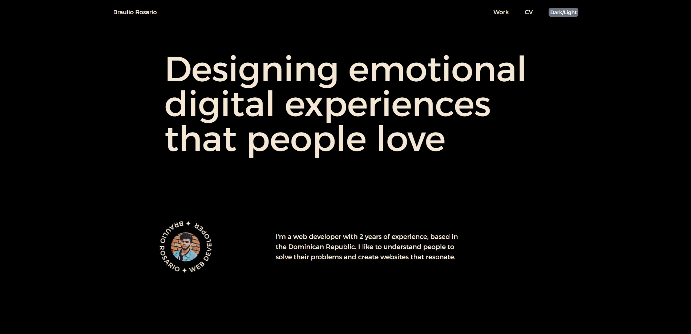
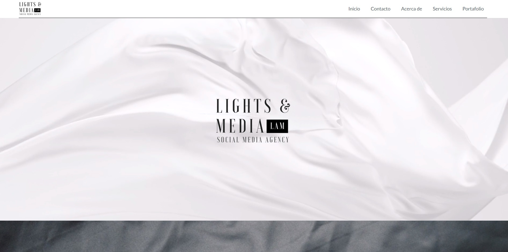
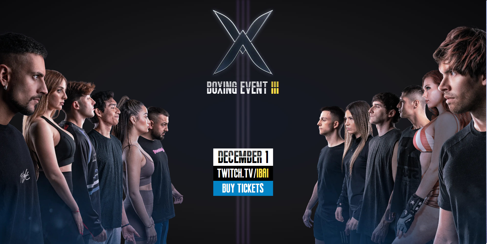

# Braulio Rosario's Portfolio

Welcome to my portfolio! This repository showcases my personal website where I highlight my projects, skills, and contact information. Feel free to explore and get to know more about me and my work.

## Table of Contents

- [About](#about)
- [Projects](#projects)
- [Contact](#contact)

## About

I am Braulio Rosario, a passionate web developer with a keen interest in creating responsive and user-friendly websites. My portfolio reflects my journey in the world of web development, demonstrating my skills and expertise in various technologies and tools.

The website's design is clean and modern, providing visitors with an easy and enjoyable browsing experience. The layout is carefully crafted to showcase my projects, achievements, and skills.

## Projects

### Lights and Media: Social Media Agency

Lights and Media is a social media agency that helps businesses and brands grow their online presence and reach their target audience. The website was built with Next, Node.js, Typescript, CSS, HTML and Tailwind CSS. The Instagram API was implemented for users to see the latest posts on the agency's account as well as Netlify Forms to handle submissions on the contact us form.

You can check out the project [here](https://lightsandmedia.agency/).

### Boxing Event Website

The Boxing Event website is one of my featured projects. It was built using Astro, JavaScript, Tailwind CSS, HTML, and CSS. The website provides information about an upcoming boxing event, featuring well-known Twitch streamers as participants. Users can learn about the event details, streamers, and find a link on the website to watch the event live.

You can check out the project [here](https://boxingevent.netlify.app/).

## Contact

Feel free to reach out to me if you have any questions, collaboration opportunities, or just want to say hello! You can contact me through the following channels:

- Email: [bdressx@gmail.com](mailto:bdressx@gmail.com)
- Phone: [+1 (849) 449-4451](tel:+18494494451)
- LinkedIn: [Braulio Rosario](https://www.linkedin.com/in/barosario/)

Thank you for visiting my portfolio. I look forward to connecting with you!
